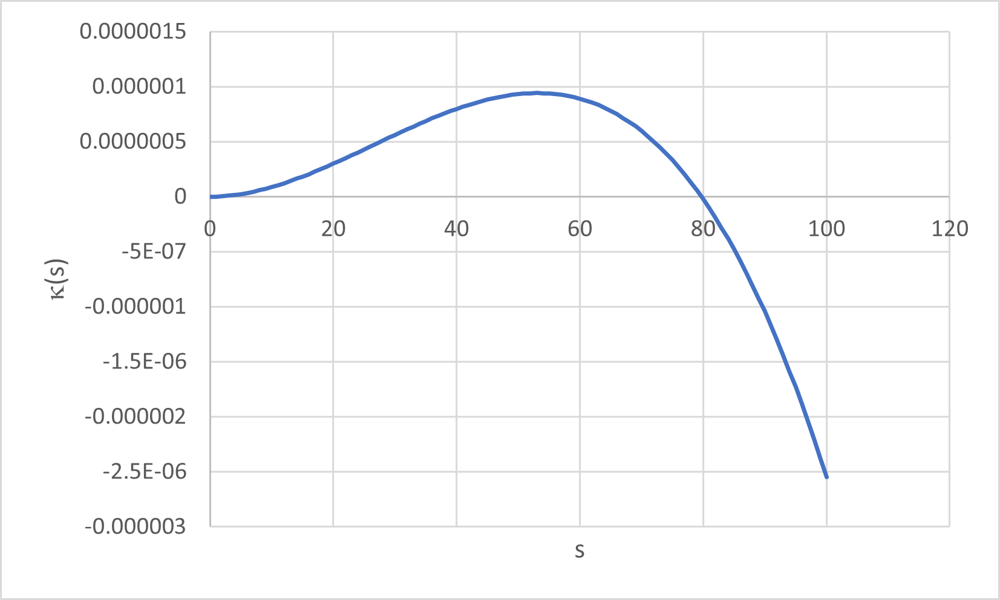

# Hand calculations suggest equations for polynomial spirals are not documented accurately.

I'm trying to implement geometry calculations for the polynomial spiral curves from the IFC specifications (IfcSecond,Third,SeventhOrderPolynomialSpiral). As the following calculations illustrate, the equations do not appear to be accurately documented.

## Problem Statement
Compute the curve coordinate (x,y) at a distance of 25 m from the start of the IfcThirdOrderPolynomialSpiral and compare to the values reported in the bSI-RailwayRoom sample files.

IFC Source File: See attached. The source file is taken from https://github.com/bSI-RailwayRoom/IFC-Rail-Sample-Files/blob/main/1_Alignment%20with%20Cant%20(AWC)/UT_AWC_0_(Synthetic_Cases)/Horizontal/SyntheticTestcases/Bloss/TS1_Bloss_100.0_inf_300_1_Meter/GENERATED__Bloss_100.0_inf_300_1_Meter.ifc in the IFC Rail Room Sample Files. The file in the Railway Room is for IFC4x3 RC 4 and does not pass the bSI validation service checks. The attached file has been modified by hand to use IFC4.3 ADD2 and to pass the bSI validation service checks.

The coodinate reported is (24.9999615671293000, 0.0292968339890285). 

The reported values are listed in https://view.officeapps.live.com/op/view.aspx?src=https%3A%2F%2Fraw.githubusercontent.com%2FbSI-RailwayRoom%2FIFC-Rail-Sample-Files%2Fmain%2F1_Alignment%2520with%2520Cant%2520(AWC)%2FUT_AWC_0_(Synthetic_Cases)%2FHorizontal%2FSyntheticTestcases%2FBloss%2FTS1_Bloss_100.0_inf_300_1_Meter%2FTS1_Bloss_100.0_inf_300_1_Meter.xlsx&wdOrigin=BROWSELINK. 

The third order polynomial spiral parameters are
> #46 = IFCTHIRDORDERPOLYNOMIALSPIRAL(#47, -531.329284591306, 1000., \$, \$);

## Calculations
From the curve definition
Term | Parameter | Value
-----|-----------|------
Cubic | $A_3$ | -531.329284591306 m
Quadratic | $A_2$ | 1000.0 m
Linear | $A_1 $ | Optional parameter, not provided
Constant | $A_0$ | Optional parameter, not provided

The governing equations as provided in the IFC documentation are:

$$\theta(t) = \frac{A_3 t^4 }{4|A_3 ^5|}+\frac{t^3}{3A_2 ^3} + \frac{A_1 t^2}{2|A_1^3|} + \frac{t}{A_0} $$
$$ x = \int_0^u cos(\theta(t))dt$$
$$ y = \int_0^u sin(\theta(t))dt$$

Substitute curve parameters into equations
$$\theta(t) = \frac{-531.329284591306 t^4 }{4|(-531.329284591306)^5|}+\frac{t^3}{3 (1000^3)}$$

Evalute the integrals with the trapezoid rule 
$$\int_a^b f(x) dx \approx \sum{0.5(f(a) + f(b))(b-a)}$$

t |	$\theta(t)$ |	$cos(\theta(t))$ |	$sin(\theta(t))$ |	$0.5(cos(\theta(t_i))+cos(\theta(t_{i+1}))(t_{i+1}-t_i)$ |	$0.5(sin(\theta(t_i))+sin(\theta(t_{i+1}))(t_{i+1}-t_i)$
|---|---|---|---|---|---|
0	| 0	| 1.000E+00	| 0.000E+00 | - | -		
1	| 3.33327E-10 |	1.000E+00 |	3.333E-10 |	1.000E+00 |	1.67E-10
2	| 2.66657E-09 |	1.000E+00 |	2.667E-09 |	1.000E+00 |	1.50E-09
3	| 8.99952E-09 | 1.000E+00 |	9.000E-09 |	1.000E+00 |	5.83E-09
4	| 2.13318E-08 |	1.000E+00 |	2.133E-08 |	1.000E+00 |	1.52E-08
5	| 4.1663E-08 |	1.000E+00 |	4.166E-08 |	1.000E+00 |	3.15E-08
6	| 7.19923E-08 |	1.000E+00 |	7.199E-08 |	1.000E+00 |	5.68E-08
7	| 1.14319E-07 |	1.000E+00 |	1.143E-07 |	1.000E+00 |	9.32E-08
8	| 1.70642E-07 | 1.000E+00 | 1.706E-07 |	1.000E+00 |	1.42E-07
9	| 2.42961E-07 |	1.000E+00 |	2.430E-07 |	1.000E+00 |	2.07E-07
10	| 3.33274E-07 |	1.000E+00 |	3.333E-07 |	1.000E+00 |	2.88E-07
11	| 4.4358E-07 |	1.000E+00 |	4.436E-07 |	1.000E+00 |	3.88E-07
12	| 5.75878E-07 |	1.000E+00 |	5.759E-07 |	1.000E+00 |	5.10E-07
13	| 7.32165E-07 |	1.000E+00 |	7.322E-07 |	1.000E+00 |	6.54E-07
14	| 9.1444E-07 |	1.000E+00 |	9.144E-07 |	1.000E+00 |	8.23E-07
15	| 1.1247E-06 |	1.000E+00 |	1.125E-06 |	1.000E+00 |	1.02E-06
16	| 1.36495E-06 |	1.000E+00 |	1.365E-06 |	1.000E+00 |	1.24E-06
17	| 1.63717E-06 |	1.000E+00 |	1.637E-06 |	1.000E+00 |	1.50E-06
18	| 1.94338E-06 |	1.000E+00 |	1.943E-06 |	1.000E+00 |	1.79E-06
19	| 2.28556E-06 |	1.000E+00 |	2.286E-06 |	1.000E+00 |	2.11E-06
20	| 2.66572E-06 |	1.000E+00 |	2.666E-06 |	1.000E+00 |	2.48E-06
21	| 3.08585E-06 |	1.000E+00 |	3.086E-06 |	1.000E+00 |	2.88E-06
22	| 3.54795E-06 |	1.000E+00 |	3.548E-06 |	1.000E+00 |	3.32E-06
23	| 4.05401E-06 |	1.000E+00 |	4.054E-06 |	1.000E+00 |	3.80E-06
24	| 4.60604E-06 |	1.000E+00 |	4.606E-06 |	1.000E+00 |	4.33E-06
25	| 5.20603E-06 |	1.000E+00 |	5.206E-06 |	1.000E+00 |	4.91E-06

Compare the computed and reported values.
Value | $x$ | $y$
-----|---|---
Computed | 25 | 3.26E-05
Reported | 24.9999615671293000 | 0.0292968339890285

The following graph compares the computed and reported values for the entire curve.

As you can see, there is a stark difference in the computed and reported values. The reported values appear to be quite reasonable which leads me to the conclusion that there are inaccuracies in the documented equations.

Additionally, IFC [4.2.2.2.2](https://standards.buildingsmart.org/IFC/RELEASE/IFC4_3/HTML/concepts/Partial_Templates/Geometry/Curve_Segment_Geometry/Bloss_Transition_Segment/content.html) contains some probable inaccuracies.

The documentaiton makes the statement "The parameter value is defined as the deflection, i.e. bearing angle &Theta". The equation provided in [8.9.3.72](https://standards.buildingsmart.org/IFC/RELEASE/IFC4_3/HTML/lexical/IfcThirdOrderPolynomialSpiral.htm) is parameterized on $u$, distance along the curve. The unit of measure for $t$ must be length else $\theta$ is not a unitless quantity. Is the statement from the IFC documentation accurate? If so, further explaination is needed.

The documentation also states the qubic term (which should be cubic term) is $L/\sqrt[3]2$ and quadratic term is $L/\sqrt3$. Using the curve parameters from the example the curve length can be computed from either term.
$$ -531.329284591306=L/\sqrt[3]2 \therefore L = (-531.329284591306)(\sqrt[3]2)=-669.43295 $$ 
$$ 1000 = L/\sqrt3 \therefore L = (1000)(\sqrt3)=577.35 $$

The result is different curve lengths. Is the information provided accurate?

Lastly, computed and reported values for curvature are compared. Curvature is defined by the equation
$$\kappa=\frac{A_3 s^3}{|A_3^5|}+\frac{s^2}{A_2^3} + \frac{A_1 s}{|A_1^3|} + \frac{1}{A_0}$$

Graph of computed curvature

Graph of reported coordinates and curvature
/UT_AWC_0_(Synthetic_Cases)/Horizontal/SyntheticTestcases/Bloss/TS1_Bloss_100.0_inf_300_1_Meter/TS1_Bloss_100.0_inf_300_1_Meter.png)

Again the comparison shows stark differences with the reported values seeming quite reasonable. This further suggests that the equations provided in the IFC documentation have inaccuracies.

