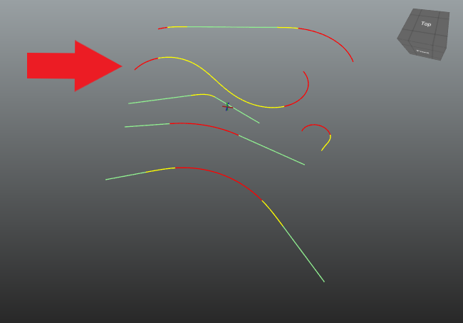
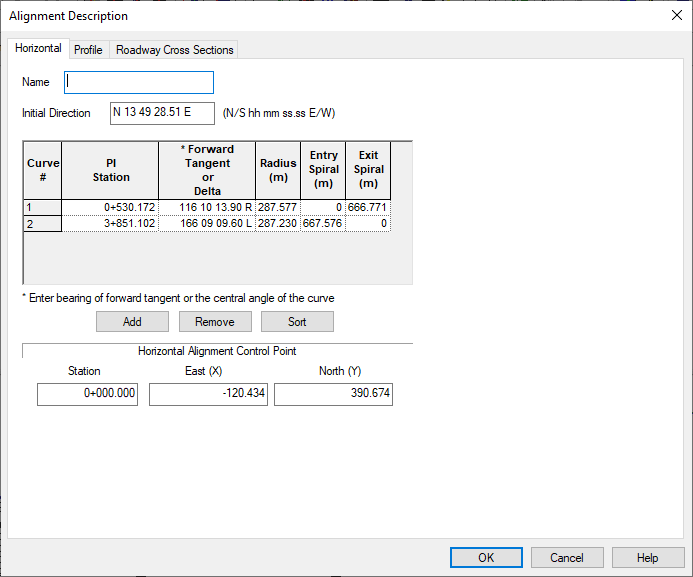

# Large Spirals Test Case

This test case is take from [https://standards.buildingsmart.org/IFC/RELEASE/IFC4_1/FINAL/HTML/link/horizontal-alignment.htm](). The fourth alignment in the file consists of

* Circular curve to the right
* Long spiral curve to the right
* Long spiral curve to the left
* Circular curve to the left

The file [TaylorSeries_vs_Integration.xlsx]() plots the clothid spiral curve geometry computed with the Taylor Series approximation and Trapezoid Rule numeric integration.

The alignment input is

The alignment modeled in BridgeLink::PGSuper is shown below. IfcOpenShell generated geometry is plotted in [LargeSpirals_IfcOpenShell_Generated_Geometry.xlsx]()

