# Spiral Curve Test Cases

This series of test cases consists of 16 cases of a straight tangent followed by a horizontal curve to the left or right.

The horizontal curve has a radius of 1000 m,  entry clothoid spiral of 200 m, exit clothoid spiral of 300 m and a sweep angle of 35 degrees (left or right), PI at 1+100. Various entry tangent (back tangent) directions are used to cover all four quadrants and coordinate axes.

Station 1+000 is located at (500 E, 700 N). This point is on the circular curve.

|Case | Entry Tangent | Curve Direction |
|-----|-------------------|-----------------|
| 1a  | N 90 E | Left
| 1b  | N 90 E | Right
| 2a  | N 30 E | Left
| 2b  | N 30 E | Right
| 3a  | N 0 E  | Left
| 3b  | N 0 E  | Right
| 4a  | N 30 W | Left
| 4b  | N 30 W | Right
| 5a  | N 90 W | Left
| 5b  | N 90 W | Right
| 6a  | S 30 W | Left
| 6b  | S 30 W | Right
| 7a  | S 0 W  | Left
| 7b  | S 0 W  | Right
| 8a  | S 30 E | Left
| 8b  | S 30 E | Right

IfcOpenShell generated geometry for each of the test cases is plotted in [SC_IfcOpenShell_Generated_Geometry.xlsx](). Screenshots of the geometry from BridgeLink::PGSuper are shown below. The IFC files are generated from BridgeLink::PGSuper.

## Test Case 1 a & b
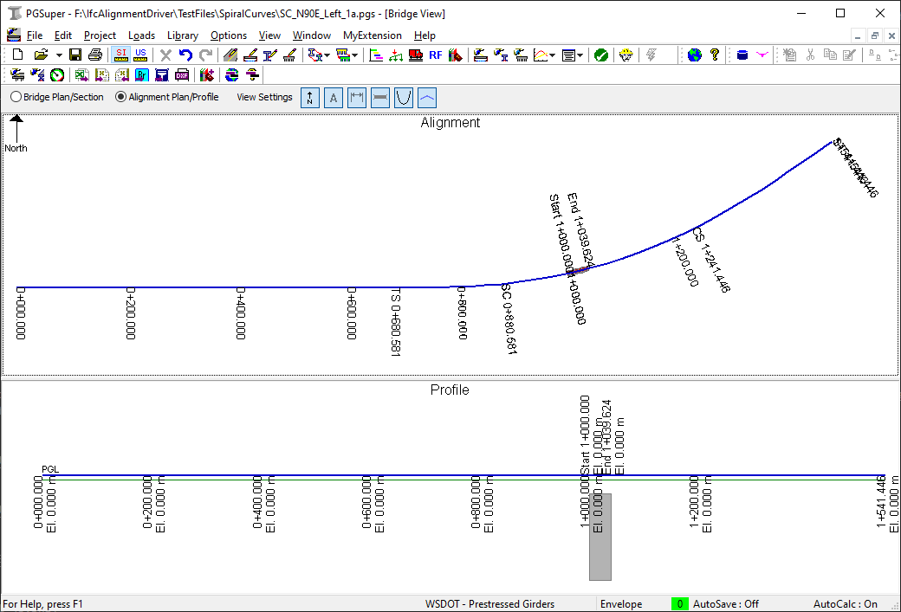 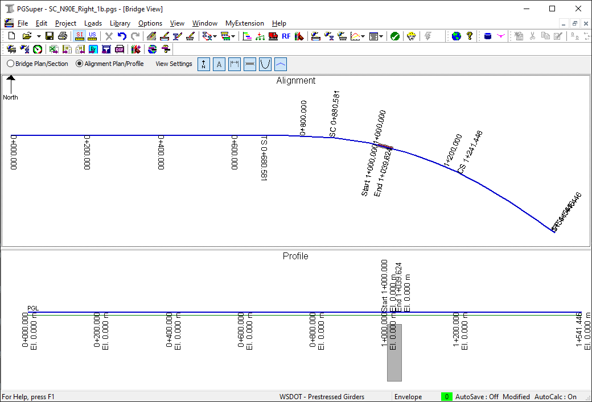

## Test Case 2 a & b
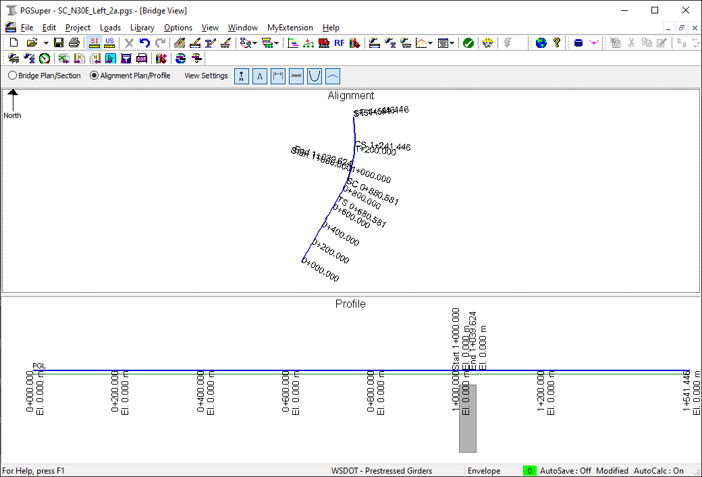 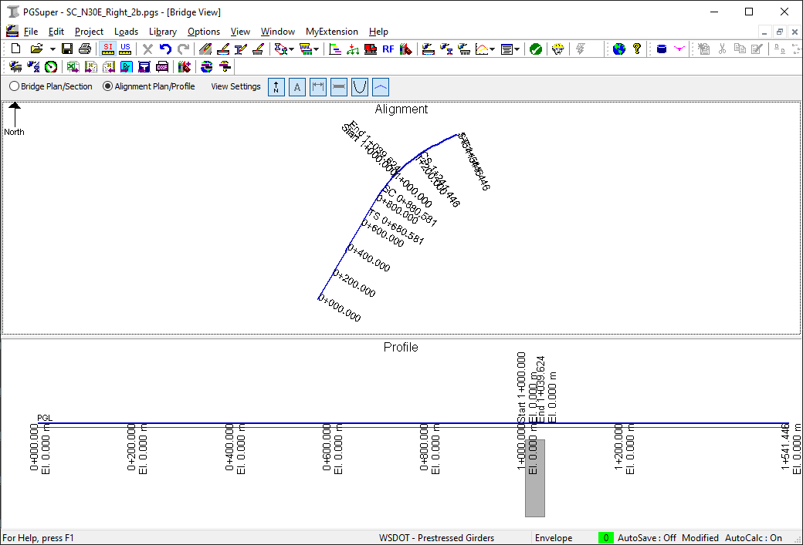

## Test Case 3 a & b
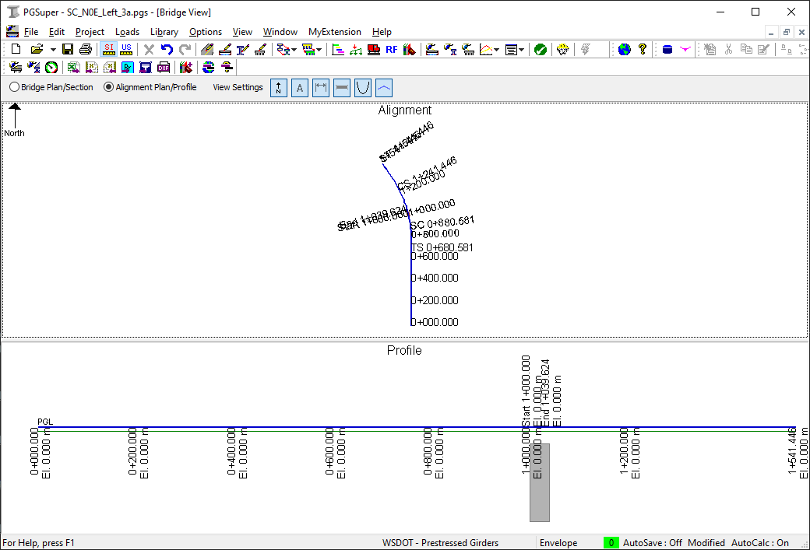 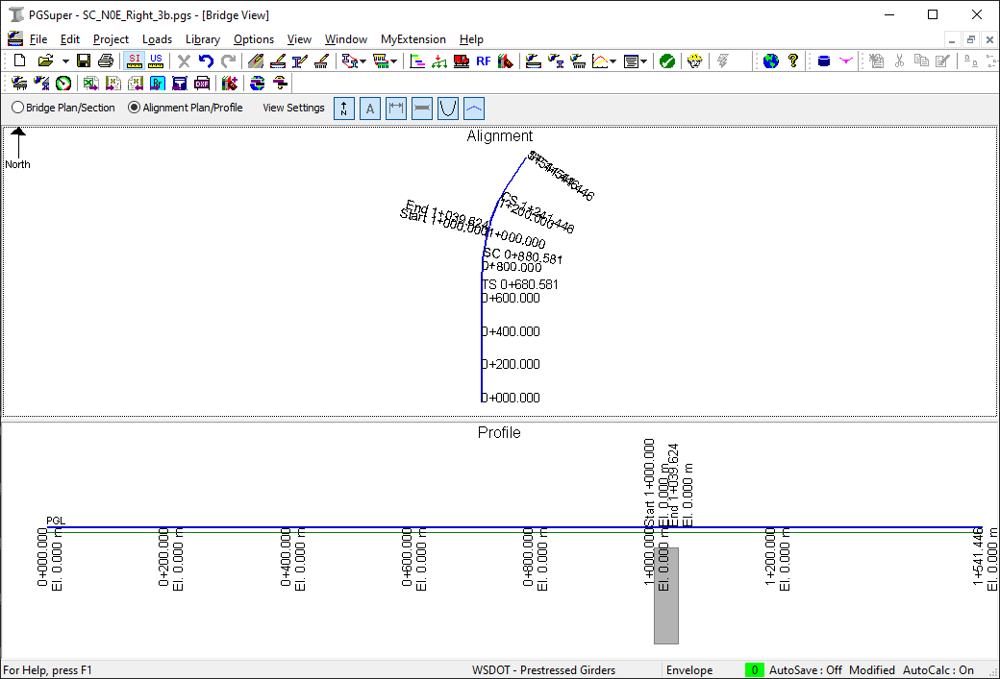

## Test Case 4 a & b
 

## Test Case 5 a & b
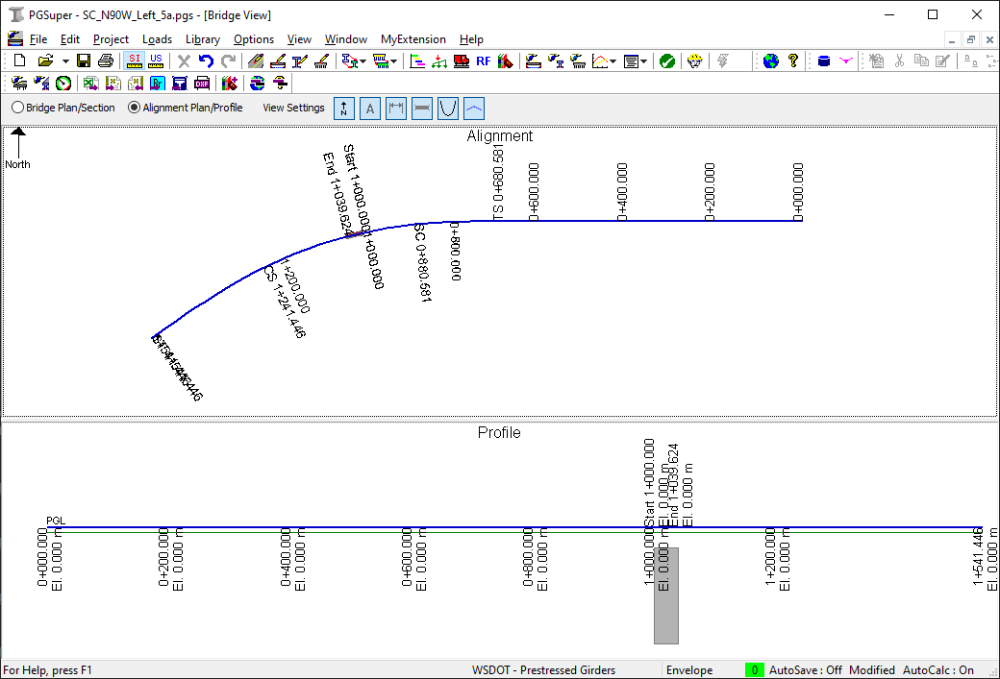 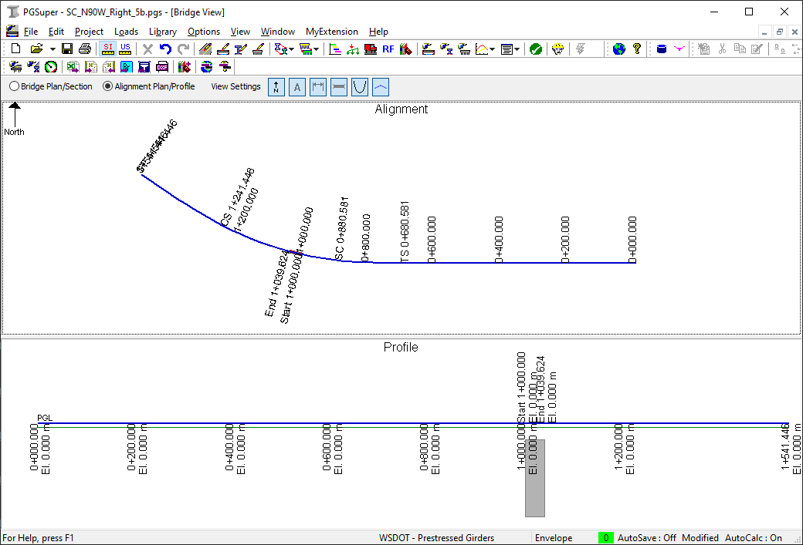

## Test Case 6 a & b
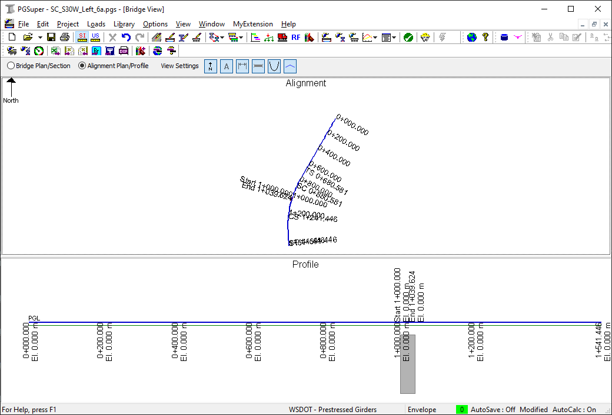 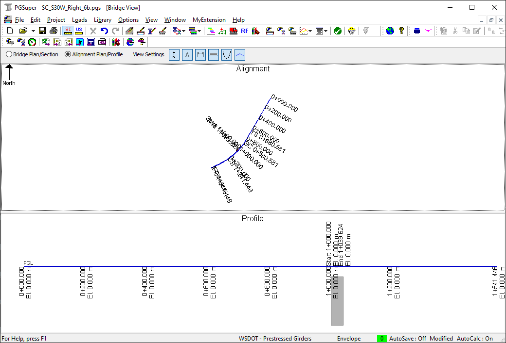

## Test Case 7 a & b
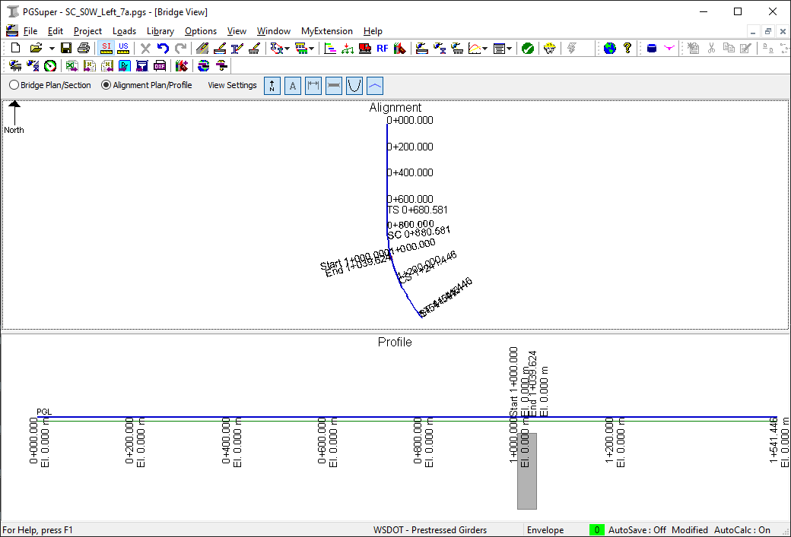 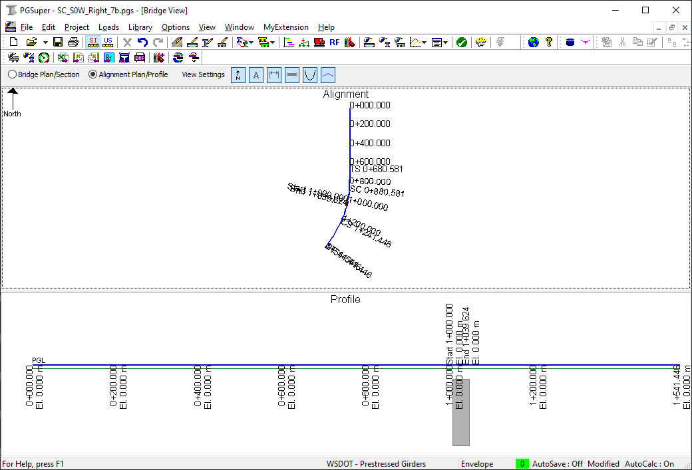

## Test Case 8 a & b
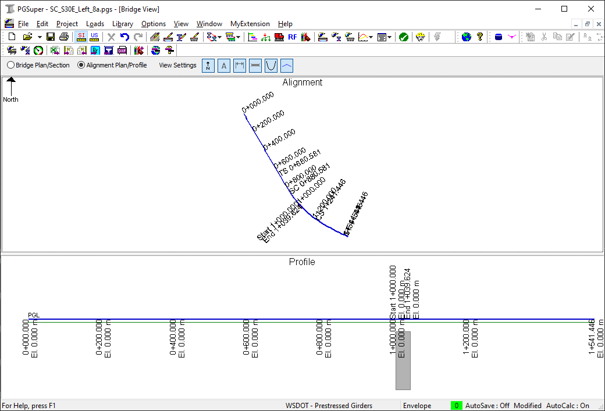 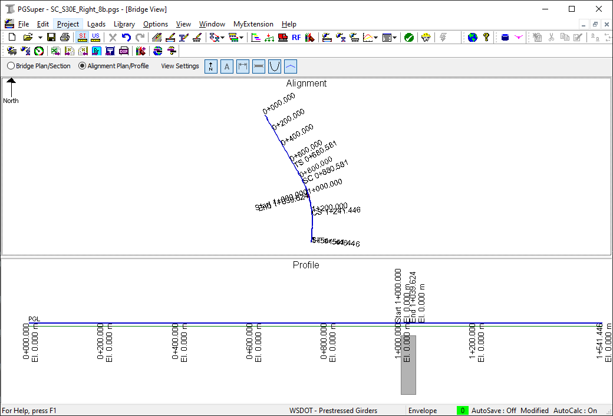